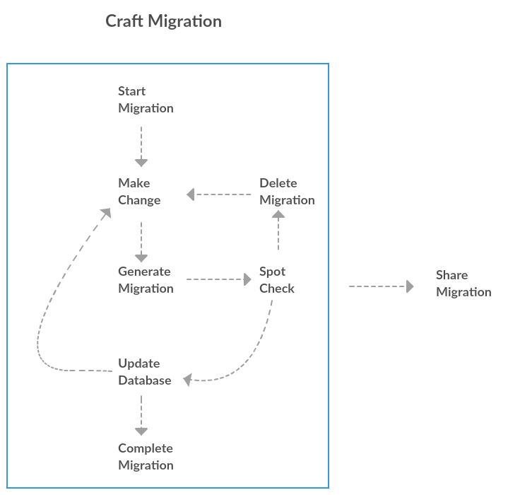

# RAM internal dev tools - workflow

When you need to make database changes, you will use the dev tool to walk you through a console based wizard. The labs get you hands on experience with using this tool.

To be most effective using the tool you need to be able to understand where the tool fits into your day-to-day workflow. This guide helps you think about that workflow.

## Overview

<small>Click <a href="https://creately.com/diagram/jhc03bir1/99FMXO0KYAm6tiv9PQC3FOZZmSQ%3D">here</a> to edit diagram</small>

As per the digram above...

1. Start migration wizard: Rams5d -DbMigration
2. Let the wizard step you through making the change(s)
3. Spot check the sql script generated
	* OK: Update the database
	* NOK: Delete migration (see notes below)
4. Optionally make additional changes letting the wizard guide you through making these changes 
5. Share migration: git push

## Deleting a migration

Deleting a migration can be performed in one of two ways:
1. Use ReadyRoll to create a script to revert database changes made by the migration
2. Drop and recreate the database

### 1. Use ReadyRoll to create a script to revert database changes

This is very convenient method when you are in the middle of a migration. It means that you do NOT have to drop and recreate database thus reducing your wait times.

**Steps**

1. Remove the migration script(s)
2. Within the ReadyRoll tool-window, click **'Refresh'** button
    * The changes introduced by the deleted migration script will be displayed
3. Select the objects in the list, then right-click on them and click **'Revert selected object(s)'**
    * The pending object list will refresh and show that all objects are now identical ie you have sucessfully reverted the changes introduce by deleted migration script

### 2. Drop and recreate database

This method is most suitable when either:
* ReadyRoll is unable to revert the changes for you
* you do not want to introduce gaps in Identity column values in the case your migration has inserted new records

**Steps**

1. Remove the migration script(s)
2. Drop the database: Rams5d -Remove -Database
3. Use the Ram.Series5.Db Visual studio solution to deploy the database (Build > Deploy Solution)
